# Mermaid Diagrams Guidelines

## Overview

Mermaid is a JavaScript-based diagramming tool that renders text-based definitions into dynamic diagrams. The project uses the `astro-mermaid` integration for automatic rendering with theme support.

## Basic Usage

### In Markdown/MDX Files

Create diagrams using fenced code blocks with the `mermaid` language identifier:

````markdown
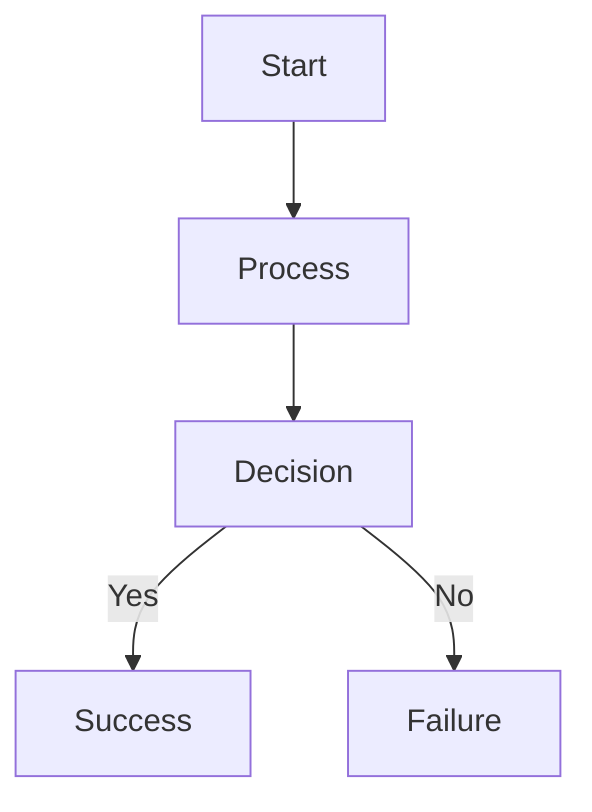
````

### In Astro Components

Diagrams in `.astro` files work the same way within the content sections.

## Diagram Types

### Flowchart

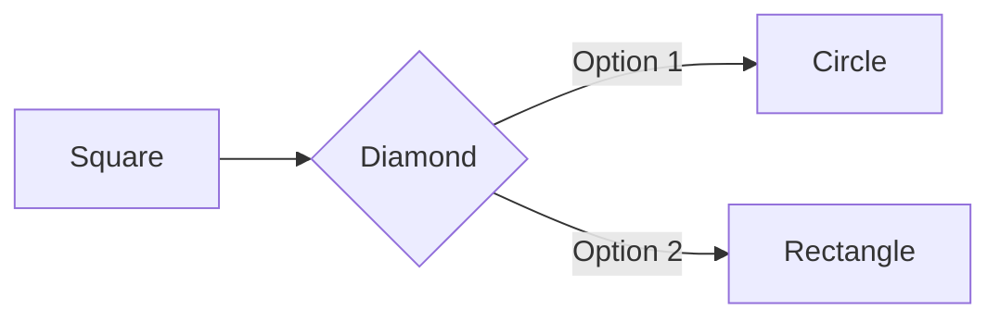

**Directions**: `TB` (top-bottom), `LR` (left-right), `RL` (right-left), `BT` (bottom-top)

### Sequence Diagram

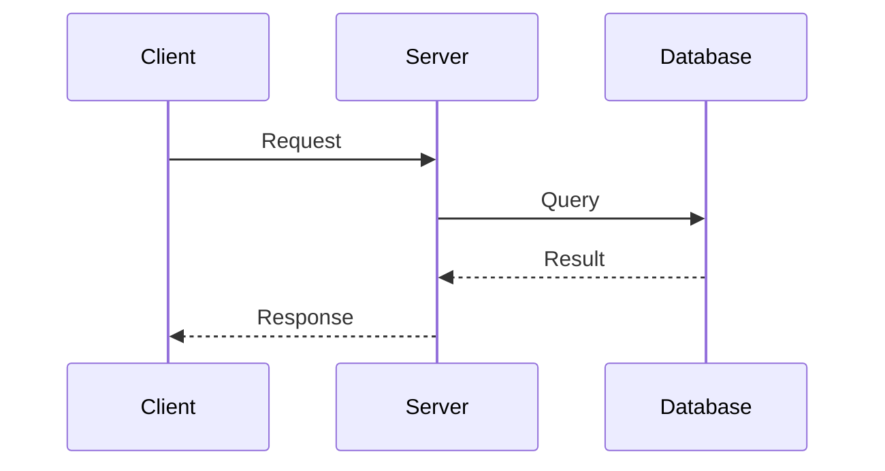

### Class Diagram

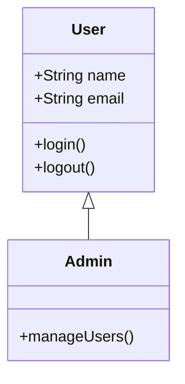

### State Diagram

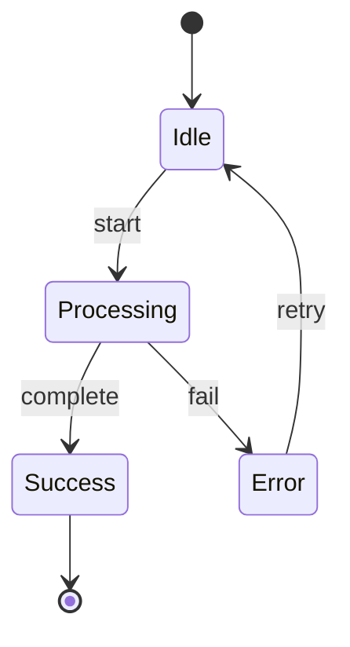

### Gantt Chart

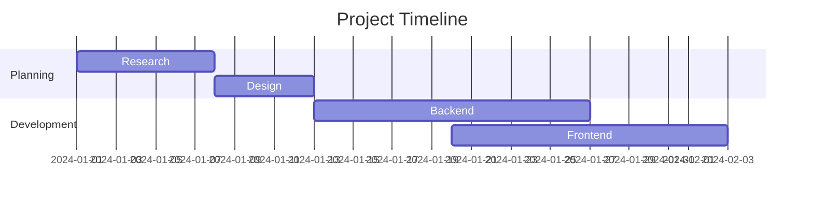

### Entity Relationship Diagram

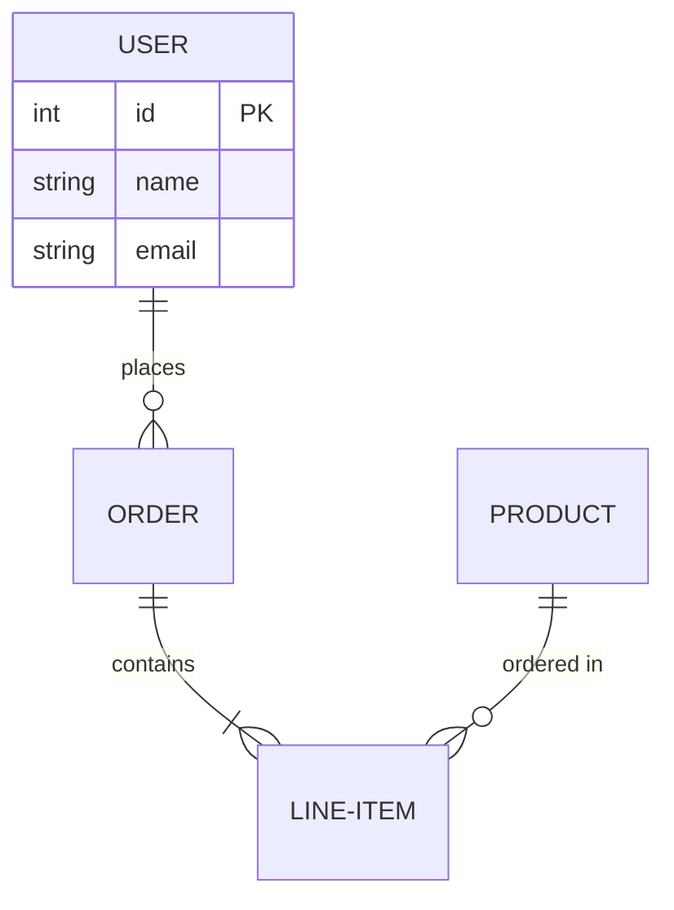

### Pie Chart

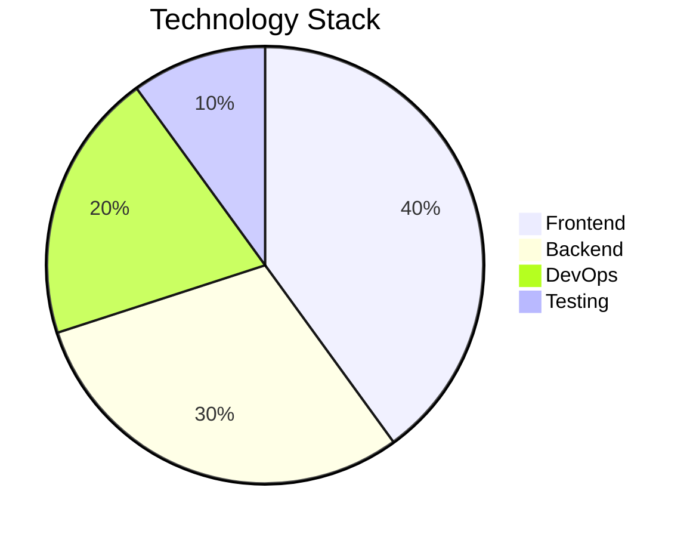

## Global Styling

The project uses a centralized theming configuration to ensure all diagrams have consistent styling across the entire site.

### Theme Configuration

Configured in `astro.config.ts`:

```typescript
mermaid({
  theme: 'base',
  autoTheme: true,
  mermaidConfig: {
    theme: 'base',
    themeVariables: {
      primaryColor: '#0ea5e9',
      primaryTextColor: '#fff',
      primaryBorderColor: '#0284c7',
      lineColor: '#64748b',
      secondaryColor: '#f1f5f9',
      tertiaryColor: '#e0f2fe',
      background: '#ffffff',
      mainBkg: '#ffffff',
      fontSize: '16px',
      fontFamily: 'Inter, system-ui, sans-serif',
    },
  },
});
```

### Theme Variables Reference

**Colors**:

- `primaryColor` - Main fill color for shapes
- `primaryTextColor` - Text color inside primary shapes
- `primaryBorderColor` - Border color for primary shapes
- `secondaryColor` - Secondary shapes fill
- `tertiaryColor` - Tertiary elements fill
- `lineColor` - Connector lines and arrows
- `background` - Diagram background
- `mainBkg` - Default background for shapes

**Typography**:

- `fontSize` - Base font size
- `fontFamily` - Font stack (matches site typography)

### Automatic Theme Switching

The integration automatically switches between light and dark themes based on the `data-theme` attribute:

- `data-theme="light"` → Uses configured base theme
- `data-theme="dark"` → Uses dark mode theme

### Customizing Global Styles

To modify the global theme:

1. Open `astro.config.ts`
2. Update the `themeVariables` in the `mermaid()` configuration
3. Use hex color codes only (e.g., `#0ea5e9`)
4. Restart the dev server for changes to take effect

**Available Themes**: `base`, `default`, `dark`, `forest`, `neutral`

Only the `base` theme supports full customization via `themeVariables`.

## Best Practices

### Diagram Complexity

- Keep diagrams focused on a single concept
- Limit nodes to 10-15 for readability
- Use subgraphs to organize complex flowcharts

### Naming Conventions

- Use descriptive node IDs: `userLogin` not `n1`
- Keep labels concise (2-4 words)
- Use consistent terminology across diagrams

### Performance

- Diagrams are rendered client-side, so limit quantity per page
- Consider splitting complex diagrams into multiple simpler ones
- Test on mobile devices for readability

### Accessibility

- Provide alternative text descriptions in surrounding content
- Use high contrast colors (already configured globally)
- Ensure text size is readable (minimum 14px)

### Version Control

- Diagrams are text-based, so they diff well in Git
- Document diagram updates in commit messages
- Keep diagram source in comments for complex ones

## Advanced Features

### Subgraphs (Flowcharts)

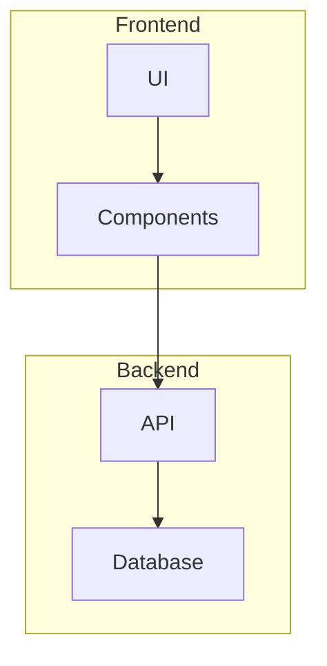

### Styling Individual Elements

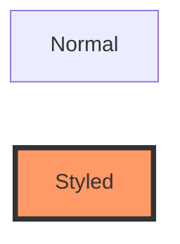

### Links and Tooltips

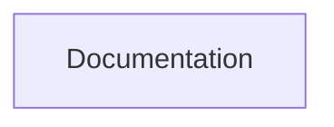

## Troubleshooting

### Diagram Not Rendering

- Check syntax with [Mermaid Live Editor](https://mermaid.live)
- Ensure code fence uses `mermaid` identifier
- Verify `astro-mermaid` is in `astro.config.ts`

### Styling Issues

- Only hex colors work in theme configuration
- Restart dev server after config changes
- Clear browser cache if changes don't appear

### Build Errors

- Validate Mermaid syntax before building
- Check for conflicting markdown plugins
- Review build logs for specific error messages

## Resources

- [Mermaid Documentation](https://mermaid.js.org/)
- [Mermaid Live Editor](https://mermaid.live)
- [astro-mermaid GitHub](https://github.com/joesaby/astro-mermaid)
- [Diagram Syntax Reference](https://mermaid.js.org/intro/syntax-reference.html)
